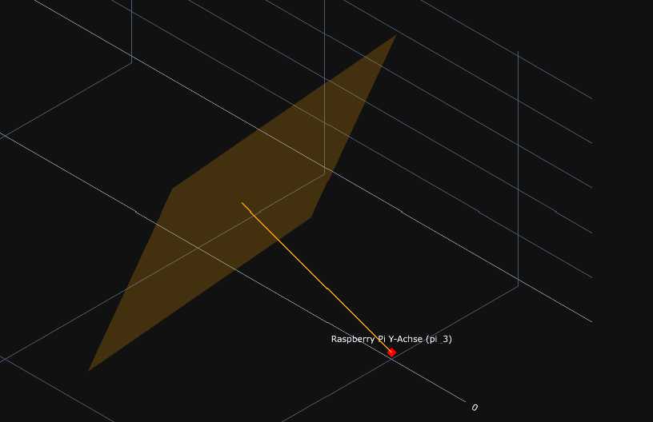
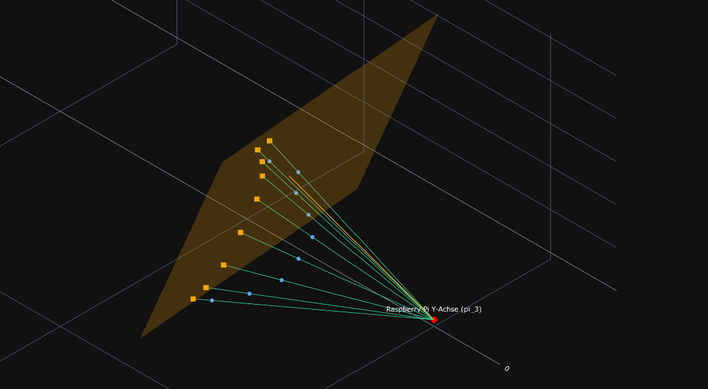
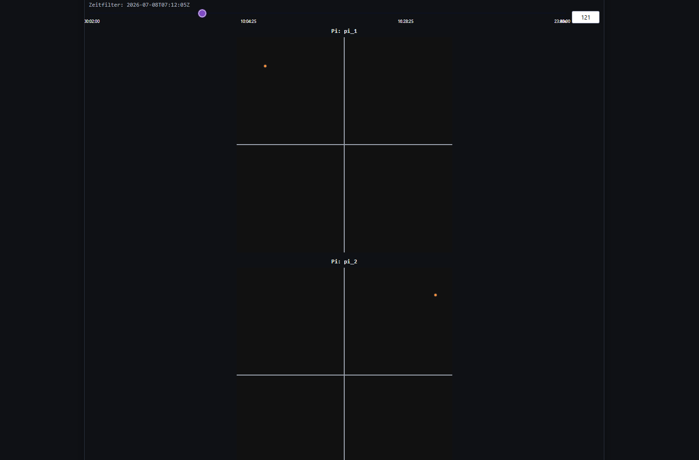

### Dokumentation der 2D-Bilder-Berechnung

Dieses Kapitel beschreibt, wie aus den generierten Vogelpositionen und den ausgerichteten Raspberry-Pi-Kameras die simulierten 2D-Kamerabilder berechnet werden. Umgesetzt ist der Ablauf in `helper_functions/pi_view_simulation.py` (Geometrie) und `webinterface.py` (Steuerung und Speicherung).

#### Datenfluss

```
vogel_flugbahnen.json / vogel_flugbahnen_determined.json
   │  (timestamp, enu_e, enu_n, enu_u)
   ▼
Punkte in Pyramiden filtern  ──►  points_in_view_volume_for_each_pi()
   ▼
Projektion auf Kameraebene    ──►  project_point_to_pi_image_coordinates()
   ▼
vogel_bilder.json  ──►  2D-Kamerabild (Tab „2D-Kamerabild“)
```

Die Berechnung besteht aus drei Schritten:

1. **Filtern** – Prüfen pro Kamera, ob ein Punkt im pyramidenförmigen Sichtvolumen liegt.
2. **Projizieren** – Perspektivische Projektion der sichtbaren 3D-Punkte auf die quadratische Kameraebene in 2D-Bildkoordinaten.
3. **Darstellen** – Anzeige als 2D-Kamerabild pro Pi und Speichern in `vogel_bilder.json`.

#### Konfiguration der Kameras (Pi-Setup)

Jeder Pi wird durch ein Dictionary mit Position und Ausrichtung beschrieben (Standard-Setup: `default_pi_setup()`, `pi_view_simulation.py:5`). Die Werte sind im Tab „Kameras“ editierbar.

| Feld         | Beschreibung                                                        |
| ------------ | ------------------------------------------------------------------- |
| `x`, `y`, `z`| Position des Pi im ENU-Koordinatensystem                            |
| `yaw_deg`    | Drehung der Blickrichtung um die Z-Achse (horizontal)               |
| `pitch_deg`  | Neigung der Blickrichtung nach oben/unten                          |
| `roll_deg`   | Rollwinkel (ohne Einfluss auf die Projektionsrichtung)              |
| `view_length`| Sichtweite zwischen Pi und Kameraebene in Metern                    |

`normalize_pi_setup()` (`pi_view_simulation.py:52`) übernimmt die Tabelleneinträge, füllt fehlende Felder auf und normalisiert alternative Schlüsselnamen. `view_length` wird in der Anwendung fest auf `400.0` gesetzt (`webinterface.py:1308`).

#### Mathematische Grundlagen

Alle geometrischen Berechnungen liegen in `helper_functions/pi_view_simulation.py`.

##### 1. Richtungsvektor aus Blickwinkeln (`direction_unit_vector`)

Wandelt `yaw`, `pitch` und `roll` in einen normierten 3D-Richtungsvektor um. Yaw dreht um die Z-Achse, Pitch kippt nach oben/unten.

```
direction_x = cos(pitch) · cos(yaw)
direction_y = cos(pitch) · sin(yaw)
direction_z = sin(pitch)
```

`compute_view_vector()` (`pi_view_simulation.py:115`) skaliert diesen Einheitsvektor mit der `view_length` zum Vektor Pi → Kameraebenen-Mittelpunkt.

##### 2. Basisvektoren der Kameraebene (`square_plane_basis`)

Erzeugt ein orthonormales Koordinatensystem für die Ebene senkrecht zur Blickrichtung: `direction_unit` (Normalenvektor) sowie `basis_u`, `basis_v` (zwei senkrechte Basisvektoren auf der Ebene). `basis_u` entsteht aus dem Kreuzprodukt von Blickrichtung und einer Referenzachse (X, Y, Z – nacheinander probiert), `basis_v` aus Kreuzprodukt von Blickrichtung und `basis_u`. So bleibt die Basis auch bei senkrechtem Blick wohldefiniert.



##### 3. Sichtbarkeit im Pyramiden-Sichtvolumen (`point_in_pi_view_volume`)

Prüft, ob ein Punkt in der Pyramide zwischen Pi (Spitze) und Kameraebene (Basis) liegt:

1. Differenzvektor `delta` zwischen Punkt und Pi-Position.
2. **Vorwärtsdistanz** `forward_distance` = Projektion von `delta` auf die normierte Blickrichtung; muss `0 ≤ forward_distance ≤ view_length` sein.
3. **Seitliche Verschiebung** `lateral_u`, `lateral_v` = Projektion von `delta` auf `basis_u` bzw. `basis_v`.
4. **Maximaler Versatz** `max_offset` = `(plane_side_length / 2) · (forward_distance / view_length)`, wächst linear von Pi zur Kameraebene (Pyramidenform).
5. Sichtbar, wenn `|lateral_u| ≤ max_offset` und `|lateral_v| ≤ max_offset` (mit Toleranz `1e-9`).

`points_in_view_volume_for_each_pi()` (`pi_view_simulation.py:408`) wendet dies pro Pi auf alle Punkte an und gruppiert die sichtbaren nach `pi_id`. Der Sinn dahinter besteht darin, dass nachfolgende Berechnungen ausschließlich mit den Punkten angestellt werden, die von der passenden Kamera gesehen werden. Was wiederum deutlich der Rechenleistung entgegenkommt.

##### 4. Projektion auf 2D-Bildkoordinaten (`project_point_to_pi_image_coordinates`)

Zentrale Funktion für das 2D-Bild. Die ersten Schritte entsprechen der Sichtbarkeitsprüfung; liegt der Punkt nicht im Sichtvolumen, wird `None` zurückgegeben. Anschließend perspektivische Skalierung:

```
projected_u = (lateral_u / max_offset) · (plane_side_length / 2)
projected_v = (lateral_v / max_offset) · (plane_side_length / 2)
```

Das Verhältnis `lateral / max_offset` ist die relative Position innerhalb der Pyramide an der aktuellen Distanz. Die Koordinaten reichen von `-plane_side_length/2` bis `+plane_side_length/2`, das Bildzentrum liegt bei `(0, 0)`.

> `project_point_to_pi_plane()` (`pi_view_simulation.py:273`) liefert stattdessen den 3D-Punkt auf der Kameraebene und wird nur für die 3D-Visualisierung der Projektionsstrahlen verwendet (`add_pi_to_bird_vectors`, `webinterface.py:476`).



#### Ablauf in der Anwendung

**Schritt 1 – Punkte in Pyramiden filtern**

In dem Übersichts Tab findet man drei Buttons, eine Ausgabe der aktuellen `vogel_flugbahnen.json`, und eine 3D Sicht dieser Punkte und der Kameras. Über den Button `Vogel-JSON laden` werden die generierten Punkte der Vögel geladen.

**Schritt 2 – Projektionen berechnen und speichern**

Der zweite Button `Punkte in Pyramiden filtern` filtert, wie anzunehmen ist, die Punkte raus, die sich nicht inerhalb einer Kamera Pyramide befinden. Zusätzlich wird auf die orangene End-Ebene jeder zu sehende Punkte über einen Vektor projeziert. Dessen zweidimensionale Koordinate der Ebene und die Daten der Kamera werden in der Datei `vogel_bilder.json` abgespeichert. 

**Schritt 3 – Darstellung als 2D-Kamerabild**

Die aus den 2D Koordinaten hervorgegangenen Bilder können unter dem Tab `2D-Kamerabild` optional begutachtet werden. Über den Slider kann man nach den Zeitstempeln filtern, wodurch jedes aufgezeichnete Bild aller drei Kameras, auf dem mindestens ein Objekt erkannt wurde, dargestellt wird. Wenn man den Slider ganz nach rechts fährt, werden alle Zeitpunkte gleichzeitig dargestellt. Hierbei lässt sich bei ausreichend Punkte bereits eine Flugkurve erkennen.



#### JSON-Ausgabeformat (`vogel_bilder.json`)

```json
"pi_images": [
    {
      "pi_id": "pi_1",
      "pi_position": {
        "x": 0.0,
        "y": 0.0,
        "z": 0.0
      },
      "view_direction_vector": {
        "x": 216.670088,
        "y": 181.807791,
        "z": 282.842712
      },
      "projected_points": [
        {
          "timestamp": "2026-07-08T03:19:00Z",
          "image_x": -34.577432,
          "image_y": 111.095668
        },
        {
          "timestamp": "2026-07-08T03:19:05Z",
          "image_x": -34.612007,
          "image_y": 143.838961
        },
    ...
```

#### Parameter

| Parameter                  | Standardwert | Ort                          | Beschreibung                                   |
| -------------------------- | ------------ | ---------------------------- | ---------------------------------------------- |
| `CAMERA_PLANE_SIDE_LENGTH` | `600.0`      | `webinterface.py:55`         | Seitenlänge der Kameraebene in Metern          |
| `view_length`              | `400.0`      | `webinterface.py:1308`        | Sichtweite Pi → Kameraebene (fest gesetzt)     |
| `tolerance`                | `1e-9`       | `pi_view_simulation.py:269`   | Numerische Toleranz bei Sichtbarkeitsprüfung   |

#### Zentrale Funktionen

| Funktion                                | Datei:Zeile                 | Aufgabe                                                |
| --------------------------------------- | --------------------------- | ------------------------------------------------------ |
| `default_pi_setup`                      | `pi_view_simulation.py:5`   | Standard-Konfiguration der drei Pis                    |
| `normalize_pi_setup`                    | `pi_view_simulation.py:52`  | Übernimmt/normalisiert die editierten Pi-Werte         |
| `direction_unit_vector`                 | `pi_view_simulation.py:89`  | Richtungsvektor aus yaw/pitch/roll                     |
| `compute_view_vector`                   | `pi_view_simulation.py:115` | Richtungsvektor skaliert auf die Sichtweite            |
| `square_plane_basis`                     | `pi_view_simulation.py:161` | Orthonormalbasis der Kameraebene (basis_u, basis_v)    |
| `point_in_pi_view_volume`               | `pi_view_simulation.py:217` | Prüft, ob ein Punkt im Pyramiden-Sichtvolumen liegt    |
| `project_point_to_pi_image_coordinates` | `pi_view_simulation.py:346` | Projiziert Punkt auf 2D-Bildkoordinaten (Zentrum 0,0)  |
| `project_point_to_pi_plane`             | `pi_view_simulation.py:273` | Projiziert Punkt auf 3D-Kameraebene (für 3D-Plot)      |
| `points_in_view_volume_for_each_pi`     | `pi_view_simulation.py:408` | Sammelt pro Pi alle sichtbaren Punkte                  |
| `save_projected_bird_images`            | `webinterface.py:368`       | Berechnet/speichert 2D-Projektionen in `vogel_bilder.json` |
| `build_camera_2d_children`              | `webinterface.py:273`       | Lädt Projektionen und baut die 2D-Ansichten für das UI |
| `build_camera_2d_figure`                | `webinterface.py:220`       | Plotly-Scatter für ein einzelnes Pi-Kamerabild        |
