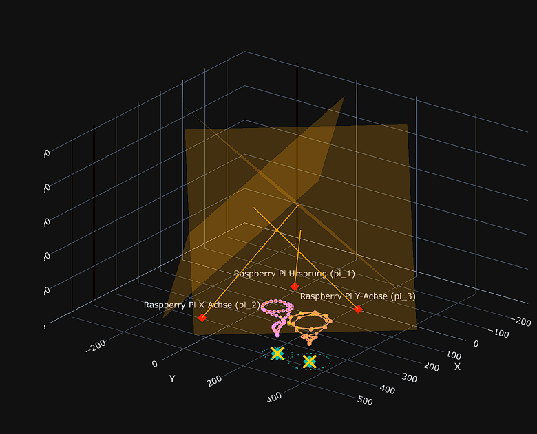
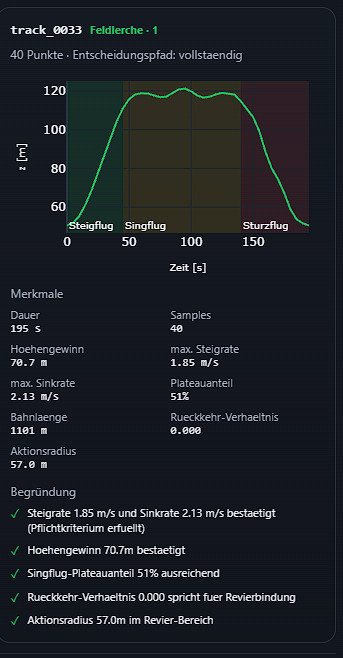

### Dokumentation der Revierschätzung

Dieses Kapitel beschreibt, wie aus den als Feldlerche klassifizierten Trajektorien das Revierzentrum — der wahrscheinliche Nestbereich — geschätzt und gegen die Ground Truth der Simulation bewertet wird. Umgesetzt ist der Ablauf in `helper_functions/territory_estimation.py`. Die Berechnung arbeitet ausschließlich mit Positions- und Zeitdaten (`timestamp`, `enu_e`, `enu_n`, `enu_u`) aus `vogel_flugbahnen_determined.json` und kommt ohne Fremdbibliotheken aus.

> **Fachliche Einordnung:** Der Singflug markiert das **Revier** des Männchens, nicht punktgenau das Nest. Das Nest liegt innerhalb des Reviers (Reviergröße in der Literatur grob 0,25–1 ha, also ein Radius von etwa 30–60 m), aber nicht zwingend in dessen Mittelpunkt. Geschätzt wird deshalb bewusst ein „Revierzentrum" bzw. ein „wahrscheinlicher Nestbereich" — kein exakter Nestort. In der Simulation ist das Revierzentrum identisch mit dem Punkt, um den `skylark_generation.py` den Singflug konstruiert (`nest_e` / `nest_n`); der gemessene Fehler ist damit ein reiner Verfahrensfehler und enthält nicht die biologische Unschärfe zwischen Revierzentrum und Nest.

> **Hinweis zur realen Anwendung:** Dieser Abschnitt ist nicht auf die Simulation beschränkt. Sobald im Livesystem Trajektorien vorliegen und als Feldlerche klassifiziert wurden, liefern dieselben Funktionen das Revierzentrum. Lediglich die Fehlerbewertung entfällt dort, weil keine Ground Truth existiert — `true_nest_position()` gibt dann `None` zurück und die Schätzung bleibt ohne Abweichungsangabe.

#### Datenfluss

```
vogel_flugbahnen_determined.json  +  Klassifikation (is_feldlerche == "Ja")
   │
   ▼
Punkte je Track sammeln und zeitlich sortieren  ──►  _sorted_points()
   ▼
Zentrum schätzen (eines von drei Verfahren)  ──►  estimate_territory()
   ▼
Revierradius bestimmen  ──►  territory_radius()
   ▼
Abweichung zur Ground Truth  ──►  evaluate_estimates()
   ▼
territory-store  ──►  3D-Plot (add_territories_to_figure) + Karten im Seitenpanel
                 ──►  GeoJSON-Export (territories_to_geojson)
```

Die Schätzung besteht aus drei Schritten:

1. **Zentrum bestimmen** – Ermittlung des wahrscheinlichsten Revierzentrums aus der Trajektorie.
2. **Radius bestimmen** – Ausdehnung des Reviers aus den Bahnradien der Singflugphase.
3. **Bewerten** – Vergleich gegen das bekannte Nest der Simulation.

#### 1. Die drei Schätzverfahren

Alle drei Verfahren arbeiten auf den Horizontalkoordinaten `(e_i, n_i)` der `n` Punkte eines Tracks. Sie sind im Webinterface umschaltbar, weil sie unterschiedliche Stärken haben — welches am besten passt, hängt davon ab, wie vollständig ein Track aufgezeichnet wurde.

##### Verfahren A: Zentroid (`estimate_centroid`)

Schwerpunkt aller Horizontalpositionen des Tracks:

```
center_e = (1/n) · Σ e_i
center_n = (1/n) · Σ n_i
```

Robust gegen Ausreißer und gegen abgeschnittene Tracks, aber systematisch verzerrt, wenn der Track die Kreisphase nicht vollständig abdeckt: Liegen mehr Punkte auf einer Seite des Kreises als auf der anderen, wandert der Schwerpunkt dorthin.

##### Verfahren B: Start-/Endpunkt-Mittel (`estimate_start_end`, Standard)

Mittel aus erstem und letztem Punkt der zeitlich sortierten Trajektorie:

```
center_e = (e_start + e_ende) / 2
center_n = (n_start + n_ende) / 2
```

Begründung: Der Steigflug beginnt und der Sturzflug endet am Revierzentrum — der Bahnradius geht in beiden Phasen gegen null (siehe `skylark_generation.py`). Bei vollständigen Tracks ist dieses Verfahren deshalb das genaueste und ist als `DEFAULT_METHOD` voreingestellt. Bei fragmentierten Tracks, etwa durch Verdeckung oder einen zu spät einsetzenden Track, ist es dagegen das schlechteste, weil dann beide Stützpunkte irgendwo auf der Kreisbahn liegen statt im Zentrum.

##### Verfahren C: Kreisfit nach Kåsa (`estimate_circle_fit`)

Dieses Verfahren nutzt die Geometrie der Kreisbahn selbst und kommt damit auch ohne beobachteten Start- und Endpunkt aus.

**Schritt 1 — Plateauphase auswählen (`plateau_points`).** Verwendet werden nur die Punkte des Singflugs, also die im obersten `PLATEAU_HEIGHT_FRACTION`-Anteil des Höhengewinns:

```
altitude_gain = z_max − z_min
threshold     = z_max − 0,15 · max(altitude_gain, 1e-6)
Plateaupunkte = { Punkte mit z ≥ threshold }
```

Das ist bewusst dieselbe Definition wie in `skylark_classifier.extract_features()` — die Schätzung stützt sich damit auf genau die Phase, die auch der Klassifikator als Singflug erkannt hat.

**Schritt 2 — Algebraischer Kreisfit.** Gesucht sind Mittelpunkt `(a, b)` und Hilfsgröße `c`, die den algebraischen Fehler minimieren:

```
minimiere  Σ (x² + y² − 2·a·x − 2·b·y − c)²   über a, b, c
```

Der Ausdruck ist in `a`, `b`, `c` linear. Nullsetzen der partiellen Ableitungen ergibt ein 3×3-Normalgleichungssystem (mit der Abkürzung `z = x² + y²`):

```
[ 2·Σx²   2·Σxy   Σx ] [a]   [Σxz]
[ 2·Σxy   2·Σy²   Σy ] [b] = [Σyz]
[ 2·Σx    2·Σy    n  ] [c]   [Σz ]
```

Der Kreismittelpunkt ist `(a, b)` und damit das geschätzte Revierzentrum.

**Schritt 3 — Lösung und Gültigkeitsprüfung.** Das System wird mit Gauß-Elimination und partieller Pivotisierung gelöst (`_solve_3x3`, Pivot-Schranke `1e-12` — dasselbe Verfahren wie `solve_linear_3x3` in `detected_positions.py`). Der Fit wird verworfen, wenn

- weniger als `MIN_PLATEAU_SAMPLES_FOR_CIRCLE_FIT = 6` Plateaupunkte vorliegen,
- die Matrix singulär ist (Punkte nahezu auf einer Geraden, also kein erkennbarer Kreisbogen), oder
- das Ergebnis nicht endlich ist.

In diesen Fällen fällt `estimate_territory()` automatisch auf den Zentroid zurück und vermerkt das im Feld `note` („Kreisfit nicht moeglich, Zentroid verwendet"), statt eine unbrauchbare Zahl auszugeben.

#### 2. Revierradius (`territory_radius`)

Der ausgegebene Radius ist das `RADIUS_PERCENTILE`-Perzentil (90.) der horizontalen Abstände zum geschätzten Zentrum:

```
abstand_i = hypot(e_i − center_e, n_i − center_n)
radius    = perzentil_90( { abstand_i } )
```

Berechnet wird er bevorzugt über die Punkte der Plateauphase, weil dort der eigentliche Kreisflug stattfindet — Steig- und Sturzflugpunkte liegen nahe am Zentrum und würden den Radius nach unten ziehen. Enthält ein Track keine Plateaupunkte, wird auf alle Punkte zurückgegriffen. Das 90.-Perzentil statt des Maximums sorgt dafür, dass ein einzelner Ausreißer den Revierkreis nicht aufbläht; berechnet wird es ohne numpy per linearer Interpolation (`_percentile`).

#### 3. Bewertung gegen Ground Truth (`evaluate_estimates`)

Für jeden Track, zu dem `nest_e` / `nest_n` vorliegen (nur in der Simulation, gesetzt von `skylark_generation.py`), wird der Lokalisierungsfehler als euklidischer Abstand in der Horizontalen berechnet:

```
error_m = hypot(center_e − nest_e, center_n − nest_n)
```

Über alle Tracks werden daraus Median, 90.-Perzentil, Maximum und Mittelwert gebildet. `compare_methods()` wendet zusätzlich alle drei Verfahren auf dieselben Tracks an und liefert je Verfahren dieselbe Fehlerstatistik — so lassen sich die Verfahren gegeneinander bewerten, statt eines zu behaupten.

#### Darstellung im 3D-Plot (`add_territories_to_figure`)

Je geschätztem Revier werden vier Elemente auf Bodenhöhe (`z = 0`) in die 3D-Figur gezeichnet:

| Element | Darstellung | Bedeutung |
| --- | --- | --- |
| Revierzentrum | türkise Raute | Geschätztes Zentrum aus dem gewählten Verfahren |
| Revierkreis | türkise gestrichelte Linie (60 Stützpunkte) | Revierradius um das geschätzte Zentrum |
| Wahres Nest | gelbes Kreuz | Ground Truth, nur in der Simulation vorhanden |
| Abweichung | gelbe Verbindungslinie | Strecke zwischen Schätzung und Ground Truth, entspricht `error_m` |



Im Bild sind zwei Feldlerchen-Tracks zu sehen (die beiden Spiralen aus Steigflug, Kreisbahn und Sturzflug). Senkrecht darunter auf Bodenhöhe liegen die zugehörigen geschätzten Revierzentren mit ihren gestrichelten Revierkreisen — die Schätzung liegt jeweils unter dem Zentrum der geflogenen Kreisbahn, nicht unter der Bahn selbst.

#### Ergebnisformat (`territory-store`)

```json
{
  "track_id": "track_0007",
  "center_e": 182.44,
  "center_n": 96.11,
  "radius": 41.3,
  "method": "start_end",
  "method_label": "Start-/Endpunkt-Mittel",
  "sample_count": 23,
  "true_nest_e": 180.0,
  "true_nest_n": 95.0,
  "error_m": 2.82,
  "note": ""
}
```

| Feld | Beschreibung |
| --- | --- |
| `center_e`, `center_n` | Geschätztes Revierzentrum in ENU-Metern |
| `radius` | Revierradius (90.-Perzentil der Bahnradien) |
| `method`, `method_label` | Tatsächlich verwendetes Verfahren (kann vom gewählten abweichen, siehe Fallback) |
| `sample_count` | Anzahl der ausgewerteten Punkte |
| `true_nest_e`, `true_nest_n` | Ground Truth, `null` bei echten Messdaten |
| `error_m` | Abstand zwischen Schätzung und Ground Truth |
| `note` | Hinweis, falls auf ein anderes Verfahren zurückgefallen wurde |

#### Bedienung im Webinterface

Der Button „Revierzentren schätzen" und die Verfahrensauswahl (`dcc.RadioItems`, `id="territory-method"`) sind beide `Input` desselben Callbacks (`estimate_territory_centers`). Ein Wechsel des Verfahrens rechnet damit sofort neu, ohne dass erneut klassifiziert werden muss — die drei Verfahren lassen sich so direkt am selben Datensatz vergleichen. Je Track entsteht im Seitenpanel eine Karte (`build_territory_card`) mit Zentrum, Radius, Punktzahl und farbig codierter Abweichung: grün bis 5 m, gelb bis 15 m, rot darüber.

#### Export der Reviere und Kartenanbindung

Die geschätzten Reviere liegen zunächst in ENU-Metern vor und haben damit keinen Ortsbezug. Über den Standort der ersten Pi-Station (siehe Doku „Pi-Standorte auf der Karte") werden sie mit `enu_to_wgs84()` in Breiten- und Längengrad umgerechnet und stehen dann in zwei Formen zur Verfügung.

##### GeoJSON-Datei (`territories_to_geojson`)

Der Button „Als GeoJSON exportieren" erzeugt eine `FeatureCollection` mit folgenden Features:

| `typ` | Geometrie | Inhalt |
| --- | --- | --- |
| `revierzentrum_geschaetzt` | Point | Geschätztes Zentrum |
| `revierflaeche` | Polygon | Revierkreis, als Polygon mit `CIRCLE_STEPS = 64` Stützpunkten angenähert (`circle_ring`) |
| `nest_ground_truth` | Point | Wahres Nest, nur in der Simulation |
| `kamerastation` | Point | Standort je Pi-Station |

GeoJSON erwartet Koordinaten in der Reihenfolge `[Länge, Breite]` — umgekehrt zur üblichen Schreibweise; das übernimmt `_position()`. Die Datei lässt sich direkt in QGIS oder Google Earth öffnen.

```json
{
  "type": "FeatureCollection",
  "name": "Feldlerchen-Reviere (Simulation)",
  "crs": { "type": "name", "properties": { "name": "urn:ogc:def:crs:OGC:1.3:CRS84" } },
  "metadata": {
    "hinweis": "Simulierte Daten. ... Dies ist KEINE Kartierung realer Brutvoegel.",
    "datenquelle": "simulation",
    "enu_referenzpunkt": {
      "latitude": 52.124165,
      "longitude": 8.500326,
      "bedeutung": "Position von pi_1, entspricht ENU (0, 0, 0)"
    },
    "reviere": 1
  },
  "features": [
    {
      "type": "Feature",
      "geometry": { "type": "Point", "coordinates": [8.502981, 52.125287] },
      "properties": {
        "track_id": "track_0007",
        "radius_m": 41.3,
        "verfahren": "Start-/Endpunkt-Mittel",
        "punkte": 23,
        "abweichung_m": 2.82,
        "koordinaten": "52.125287, 8.502981",
        "google_maps_url": "https://www.google.com/maps?q=52.125287,8.502981",
        "navigation_url": "https://www.google.com/maps/dir/?api=1&destination=52.125287,8.502981",
        "datenquelle": "simulation",
        "name": "Revierzentrum track_0007",
        "typ": "revierzentrum_geschaetzt"
      }
    }
  ]
}
```

> **Kennzeichnung als Simulationsdaten:** Sowohl die Metadaten der Datei als auch **jedes einzelne Feature** tragen das Feld `"datenquelle": "simulation"`. Eine GeoJSON-Datei wandert erfahrungsgemäß schnell weiter, und ohne diese Kennzeichnung sähe sie in QGIS aus wie eine echte Brutvogelkartierung. Der Hinweistext in `metadata.hinweis` sagt das zusätzlich im Klartext.

##### Kartenlinks (`territory_map_links`)

Je Revierkarte im Seitenpanel werden Koordinate und drei Links angezeigt. Sie funktionieren ohne kostenpflichtige Google-API, weil keine Kacheln eingebettet, sondern nur URLs geöffnet werden:

```
Karte       → https://www.google.com/maps?q={lat},{lon}
Satellit    → https://www.google.com/maps/@{lat},{lon},{zoom}z/data=!3m1!1e3
Navigation  → https://www.google.com/maps/dir/?api=1&destination={lat},{lon}
```

Der Navigations-Link startet direkt die Routenführung zum geschätzten Revierzentrum — für eine Begehung im Feld ist das der praktisch relevante Weg von der Erkennung zum Standort.

#### Parameter

| Parameter | Standardwert | Ort | Beschreibung |
| --- | --- | --- | --- |
| `DEFAULT_METHOD` | `"start_end"` | `territory_estimation.py:53` | Vorausgewähltes Schätzverfahren |
| `PLATEAU_HEIGHT_FRACTION` | `0.15` | `territory_estimation.py:66` | Anteil des Höhengewinns, ab dem ein Punkt zur Plateauphase zählt |
| `RADIUS_PERCENTILE` | `90.0` | `territory_estimation.py:69` | Perzentil der Bahnradien, das als Revierradius ausgegeben wird |
| `MIN_SAMPLES` | `4` | `territory_estimation.py:72` | Mindestpunktzahl für eine Schätzung |
| `MIN_PLATEAU_SAMPLES_FOR_CIRCLE_FIT` | `6` | `territory_estimation.py:75` | Mindest-Plateaupunkte für den Kreisfit |
| Pivot-Schranke | `1e-12` | `territory_estimation.py:161` | Singularitätsprüfung beim Lösen des LGS |
| `CIRCLE_STEPS` | `64` | `geo_export.py:51` | Stützpunkte des Revierpolygons im GeoJSON |

#### Zentrale Funktionen

| Funktion | Datei | Aufgabe |
| --- | --- | --- |
| `estimate_territory` | `territory_estimation.py` | Schätzung für einen Track inklusive Fallback-Logik |
| `estimate_territories` | `territory_estimation.py` | Schätzung für mehrere Tracks (die als Feldlerche klassifizierten) |
| `estimate_centroid` | `territory_estimation.py` | Verfahren A: Schwerpunkt |
| `estimate_start_end` | `territory_estimation.py` | Verfahren B: Start-/End-Mittel |
| `estimate_circle_fit` | `territory_estimation.py` | Verfahren C: Kåsa-Kreisfit auf der Plateauphase |
| `plateau_points` | `territory_estimation.py` | Wählt die Punkte der Singflugphase aus |
| `_solve_3x3` | `territory_estimation.py` | Löst das 3×3-Normalgleichungssystem (Gauß mit Pivotisierung) |
| `territory_radius` | `territory_estimation.py` | Revierradius als Perzentil der Bahnradien |
| `true_nest_position` | `territory_estimation.py` | Liest die Ground-Truth-Nestposition aus den Records |
| `evaluate_estimates` | `territory_estimation.py` | Fehlerstatistik (Median, p90, Maximum, Mittelwert) |
| `compare_methods` | `territory_estimation.py` | Wendet alle Verfahren auf dieselben Tracks an |
| `add_territories_to_figure` | `webinterface_geo.py` | Zeichnet Zentrum, Revierkreis, Nest und Abweichung in den 3D-Plot |
| `territories_to_geojson` | `geo_export.py` | Baut die GeoJSON-FeatureCollection |
| `circle_ring` | `geo_export.py` | Nähert einen Revierkreis als geschlossenes GeoJSON-Polygon an |
| `territory_map_links` | `webinterface_geo.py` | Koordinate und Google-Maps-Links je Revierkarte |

---

### Dokumentation der Flugprofile (Track-Detail)

Dieses Kapitel beschreibt das Detailpanel, das beim Anklicken einer Zeile in der Klassifikationstabelle den Höhenverlauf `z(t)` eines einzelnen Tracks mit eingefärbten Flugphasen, dessen Merkmale und die Begründung der Klassifikation zeigt. Umgesetzt ist es in `helper_functions/track_detail.py`.

Der Zweck ist die Nachvollziehbarkeit: Die Klassifikation liefert für sich genommen nur „Feldlerche: Ja/Nein" und einen Score. Das Flugprofil macht sichtbar, **warum** — und deckt umgekehrt Fälle auf, in denen die Entscheidung auf einer schwachen Datenlage beruht.

#### Datenfluss

```
Klick auf eine Zeile in lark-classification-table  (active_cell)
   │
   ▼
show_track_detail()  ──►  filtert die Records dieses Tracks aus
                          vogel_flugbahnen_determined.json
   │
   ├──►  _sorted_samples()  ──►  detect_phases()  ──►  build_altitude_profile_figure()
   │                                                   (z(t) mit Phasenbändern)
   │
   └──►  features_to_dict()  ──►  format_feature_rows()  ──►  Merkmalstabelle
                              +   criteria aus der Klassifikation  ──►  Begründung
```

#### Phasenerkennung (`detect_phases`)

Die Phasengrenzen werden nach derselben Plateau-Definition bestimmt wie in `skylark_classifier.extract_features()`. Die Färbung zeigt damit exakt die Struktur, auf die der Klassifikator seine Entscheidung stützt — und nicht eine zweite, eigene Interpretation der Daten.

```
altitude_gain = z_max − z_min
threshold     = z_max − 0,15 · max(altitude_gain, 1e-6)
Plateaupunkte = { Indizes mit z ≥ threshold }

Steigflug  = [ Trackbeginn ,  erster Plateaupunkt )
Singflug   = [ erster Plateaupunkt , letzter Plateaupunkt ]
Sturzflug  = ( letzter Plateaupunkt , Trackende ]
```

Phasen ohne zeitliche Ausdehnung werden weggelassen — bei einem Track, der nur die Plateauphase enthält, bleibt entsprechend nur ein Band übrig.

##### Absolute Untergrenze für Phasen

Vor der relativen Auswertung steht eine absolute Prüfung:

```
wenn altitude_gain < MIN_ALTITUDE_GAIN_FOR_PHASES  →  keine Phasen
```

`MIN_ALTITUDE_GAIN_FOR_PHASES` wird nicht separat festgelegt, sondern aus dem Klassifikator importiert:

```python
from helper_functions.skylark_classifier import DEFAULT_THRESHOLDS

MIN_ALTITUDE_GAIN_FOR_PHASES = float(DEFAULT_THRESHOLDS["min_altitude_gain"])  # 15,0 m
```

Grund: Die Plateau-Definition ist rein **relativ** — sie teilt jeden Höhenverlauf in „oberste 15 % " und „Rest", unabhängig davon, wie groß der Höhenunterschied absolut ist. Ohne die Untergrenze würde damit auch ein Messrauschen von wenigen Zentimetern sauber in „Steigflug" und „Sturzflug" zerlegt: Die Grafik behauptete dann Flugphasen, die der Klassifikator selbst mangels Mindesthöhenhub längst verworfen hat. Durch die Kopplung an `DEFAULT_THRESHOLDS` bleiben Grafik und Klassifikation zwangsläufig konsistent, auch wenn der Schwellenwert später geändert wird.

#### Darstellung (`build_altitude_profile_figure`)

- Jede erkannte Phase wird als halbtransparentes Hintergrundband (`add_vrect`) hinterlegt: Steigflug grün, Singflug gelb, Sturzflug rot.
- Bänder, die weniger als `MIN_PHASE_LABEL_FRACTION` (10 %) der Trackdauer abdecken, bleiben **unbeschriftet** — die Beschriftung würde sonst über die Nachbarphasen laufen.
- Wurden keine Phasen erkannt, erscheint statt der Bänder der Hinweis „Kein auswertbarer Höhenwechsel (Hub X m < 15 m)".
- Die Höhenachse erhält über `altitude_axis_range()` eine **Mindestspanne** von `MIN_ALTITUDE_AXIS_SPAN = 10 m`. Ohne sie würde Plotly ein flaches Profil auf wenige Zentimeter aufspreizen und reines Messrauschen wie ein Gebirge darstellen. Ein echter Singflug (50–120 m Hub) wird von der Mindestspanne nicht beeinflusst, weil dort die tatsächliche Spanne größer ist.



Im Bild ist `track_0033` zu sehen: Der Höhenverlauf steigt in rund 40 Sekunden auf etwa 120 m (grünes Band), hält diese Höhe über die Singflugphase (gelbes Band, 51 % der Trackdauer) und fällt am Ende wieder ab (rotes Band). Darunter stehen die extrahierten Merkmale und die einzelnen erfüllten Kriterien der Klassifikation.

#### Merkmalstabelle (`features_to_dict`, `format_feature_rows`)

| Feld | Beschriftung | Format |
| --- | --- | --- |
| `duration_s` | Dauer | `{:.0f} s` |
| `sample_count` | Samples | `{:.0f}` |
| `altitude_gain` | Höhengewinn | `{:.1f} m` |
| `max_climb_rate` | max. Steigrate | `{:.2f} m/s` |
| `max_descent_rate` | max. Sinkrate | `{:.2f} m/s` |
| `hover_fraction` | Plateauanteil | `{:.0%}` |
| `horizontal_path_length` | Bahnlänge | `{:.0f} m` |
| `return_ratio` | Rückkehr-Verhältnis | `{:.3f}` |
| `max_radius_from_centroid` | Aktionsradius | `{:.1f} m` |

Das **Rückkehr-Verhältnis** ist ein abgeleitetes Merkmal, das der Klassifikator intern berechnet, aber nicht als Merkmal ablegt:

```
return_ratio = net_horizontal_displacement / horizontal_path_length
```

Es setzt die Nettoverschiebung (Abstand zwischen erstem und letztem Punkt) ins Verhältnis zur tatsächlich zurückgelegten Bahnlänge. Ein Wert nahe `0` bedeutet, dass der Vogel zu seinem Ausgangspunkt zurückkehrt — genau das Verhalten, das den Singflug an ein Revier bindet. Ein Wert nahe `1` steht für einen weitgehend geraden Durchflug. Bei einer Bahnlänge nahe null wird `1.0` angenommen, um eine Division durch null zu vermeiden.

Zusätzlich zur Merkmalstabelle zeigt das Panel die Kriterien der Klassifikation einzeln an. Dafür wurde `ClassificationResult` um das Feld `criteria` erweitert — eine strukturierte Fassung der bisherigen Freitext-`reasons` mit je `{"text", "met": bool, "weight"}`, sodass erfüllte und nicht erfüllte Kriterien im Panel unterschiedlich dargestellt werden können.

#### Parameter

| Parameter | Standardwert | Ort | Beschreibung |
| --- | --- | --- | --- |
| `PLATEAU_HEIGHT_FRACTION` | `0.15` | `track_detail.py:24` | Anteil des Höhengewinns, ab dem ein Punkt zur Plateauphase zählt |
| `MIN_ALTITUDE_GAIN_FOR_PHASES` | `15.0` m | `track_detail.py:33` | Absolute Untergrenze, unter der keine Phasen ausgewiesen werden (aus `DEFAULT_THRESHOLDS`) |
| `MIN_PHASE_LABEL_FRACTION` | `0.10` | `track_detail.py:37` | Mindestanteil der Trackdauer, ab dem eine Phase beschriftet wird |
| `MIN_ALTITUDE_AXIS_SPAN` | `10.0` m | `track_detail.py:43` | Mindestspanne der Höhenachse |

#### Zentrale Funktionen

| Funktion | Datei | Aufgabe |
| --- | --- | --- |
| `_sorted_samples` | `track_detail.py` | Liefert `(Sekunden seit Trackbeginn, Höhe)` zeitlich sortiert |
| `detect_phases` | `track_detail.py` | Bestimmt die Zeitgrenzen der drei Flugphasen |
| `build_altitude_profile_figure` | `track_detail.py` | Baut den z(t)-Plot mit farbigen Phasenbändern |
| `altitude_axis_range` | `track_detail.py` | Höhenachsenbereich mit Mindestspanne |
| `features_to_dict` | `track_detail.py` | Wandelt `FlightFeatures` in ein serialisierbares Dict um |
| `format_feature_rows` | `track_detail.py` | Formatiert die Merkmale für die Anzeige im Panel |
| `show_track_detail` | `webinterface_geo.py` | Callback: füllt das Panel für die angeklickte Tabellenzeile |
