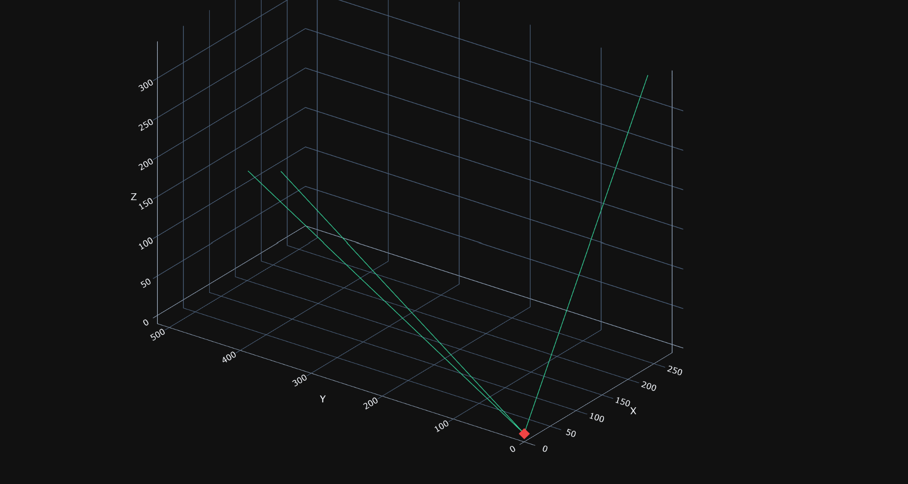
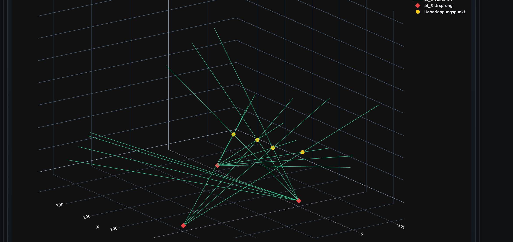

### Dokumentation der Vektor-Überschneidung

Dieses Kapitel beschreibt, wie aus den 2D-Bildpunkten der Kameras wieder 3D-Sichtstrahlen (Vektoren) rekonstruiert werden und wie deren Überschneidungspunkt die Position eines Vogels bestimmt. Umgesetzt ist der Ablauf in `helper_functions/detected_positions.py`. Die Berechnung basiert ausschließlich auf den Daten aus `vogel_bilder.json`.

> **Hinweis zur realen Anwendung:** Dieser Abschnitt ist nicht auf die Simulation beschränkt. Dieselbe Vorgehensweise lässt sich im Livesystem einsetzen: Sobald mehrere Kameras dasselbe Objekt erfassen und die 2D-Bildpunkte sowie die bekannte Kamera-Position und -Ausrichtung vorliegen, können mit denselben Funktionen Sichtstrahlen gebildet und deren Überschneidung als erkannte Objektposition berechnet werden.

#### Datenfluss

```
vogel_bilder.json
   │  (pi_position, view_direction_vector, projected_points mit image_x/image_y)
   ▼
3D-Sichtstrahlen rekonstruieren  ──►  build_detected_positions_payload()
   ▼
Vektoren nach Zeitstempel gruppieren  ──►  find_vector_overlaps_by_timestamp()
   ▼
Überschneidungspunkt pro Zeitstempel berechnen  ──►  estimate_overlap_for_vectors()
   ▼
vogel_position_erkannt.json  (detected_vectors + overlaps)
```

Die Berechnung besteht aus drei Schritten:

1. **Vektoren bilden** – Rekonstruktion eines 3D-Sichtstrahls pro 2D-Bildpunkt und Kamera.
2. **Gruppieren** – Zusammenfassung aller Vektoren mit gleichem Zeitstempel.
3. **Überschneidung berechnen** – Ermittlung der Punkte, wo es bei mindestens 2 Vektoren zur gleichen Zeit eine Überschneidung gibt.

#### 1. Rekonstruktion der 3D-Sichtstrahlen (`build_detected_positions_payload`)

Jeder 2D-Bildpunkt `(image_x, image_y)` aus `vogel_bilder.json` wird zusammen mit den Kameradaten in einen 3D-Sichtstrahl zurückverwandelt. Ein Sichtstrahl ist definiert durch seinen Ursprung (Kameraposition) und seine Richtung.

##### Ebene und Bildpunkt zurück in den 3D-Raum

Aus `pi_position` (Ursprung `o`) und `view_direction_vector` (Vektor `v` vom Pi zum Mittelpunkt der Kameraebene) werden zunächst die Basisvektoren der Kameraebene bestimmt:

- `plane_center = o + v` (Mittelpunkt der Kameraebene)
- `basis_u`, `basis_v` = Orthonormalbasis der Ebene, senkrecht zu `v` (über `square_plane_basis()`, siehe Doku 2D-Bilder-Berechnung).

Der 2D-Bildpunkt `(image_x, image_y)` beschreibt eine Verschiebung auf der Ebene ausgehend vom Bildzentrum. Der zugehörige 3D-Punkt auf der Kameraebene ist:

```
target = plane_center + basis_u · image_x + basis_v · image_y
```

##### Sichtstrahl

Der Sichtstrahl läuft vom Pi-Ursprung durch diesen Punkt auf der Ebene. Seine Richtung ist:

```
richtung = target - origin = v + basis_u · image_x + basis_v · image_y
```



Pro Bildpunkt entsteht somit ein Vektor-Eintrag:

```json
"detected_vectors": [
    {
      "pi_id": "pi_1",
      "timestamp": "2026-07-08T03:19:00Z",
      "origin": {
        "x": 0.0,
        "y": 0.0,
        "z": 0.0
      },
      "vector": {
        "x": 254.621914,
        "y": 258.790786,
        "z": 204.286212
      }
    },
    ...
```

`origin` ist die Kameraposition, `vector` ist der Richtungsvektor des Sichtstrahls.

#### 2. Gruppierung nach Zeitstempel (`find_vector_overlaps_by_timestamp`)

Vektoren können nur dann eine Position bestimmen, wenn sie dasselbe Objekt zum selben Zeitpunkt erfassen. Daher werden alle Vektoren nach ihrem `timestamp` gruppiert. Jede Zeitgruppe enthält die Sichtstrahlen aller Kameras, die zum selben Zeitpunkt ein Objekt erkannt haben.

Für jede Zeitgruppe wird anschließend `estimate_overlap_for_vectors()` aufgerufen. Weniger als zwei Vektoren in einer Gruppe führen zu keinem Ergebnis.

#### 3. Berechnung des Überschneidungspunkts (`estimate_overlap_for_vectors`)

Da die Sichtstrahlen aufgrund von Rundung, Rauschen und Diskretisierung in der Praxis nicht exakt in einem Punkt zusammentreffen, wird der Punkt gesucht, der allen Linien am nächsten liegt. Das ist ein Least-Squares-Ausgleich über alle Sichtstrahlen.

##### Linienmodell

Jede Linie `i` ist gegeben durch Ursprung `o_i` und normierten Richtungsvektor `d_i` (Länge 1). Ein Punkt `p` hat zu jeder Linie den senkrechten Abstand:

```
abstand_i = ||(p - o_i) - ((p - o_i) · d_i) · d_i||
         = ||(I - d_i d_iᵀ)(p - o_i)||
```

`P_i = (I - d_i d_iᵀ)` ist die Projektionsmatrix auf die Ebene senkrecht zur Linie. Sie ist symmetrisch und idempotent (`P_i² = P_i`).

##### Least-Squares-Normalgleichung

Gesucht ist `p`, das die Summe der quadrierten Abstände minimiert. Durch Nullsetzen der Ableitung entsteht die Normalgleichung:

```
(Σ P_i) · p = Σ P_i · o_i
```

Aufgebaut als 3×3-System `M · p = b`:

```
M = Σ (I - d_i d_iᵀ)      (Matrix, aufsummiert über alle Linien)
b = Σ (I - d_i d_iᵀ) o_i  (rechte Seite)
```

In der Implementierung (`detected_positions.py:190`–`214`) wird `projection = d_i · d_iᵀ` als äußeres Produkt berechnet; `M` und `b` werden schrittweise über alle Linien aufsummiert.

##### Lösung und Gültigkeitsprüfung

Das lineare System wird mit Gauß-Elimination und partieller Pivotisierung gelöst (`solve_linear_3x3`, `detected_positions.py:112`). Ist die Matrix singulär (Pivot ≤ `1e-12`), gibt es keine eindeutige Lösung.

Nach der Lösung werden die Residuen berechnet – der Abstand des Ergebnispunkts zu jeder einzelnen Linie:

```
abstand_i = ||(p - o_i) × d_i||
```

(da `d_i` normiert ist, entspricht der Betrag des Kreuzprodukts dem senkrechten Abstand, `point_line_distance`, `detected_positions.py:138`).

Der größte Abstand `max_distance` entscheidet über die Gültigkeit:

- `max_distance > tolerance` → kein gültiger Überschneidungspunkt, Ergebnis wird verworfen.
- sonst → der Punkt gilt als erkannte Vogelposition.



##### Ergebnis

```json
{
  "timestamp": "2026-07-08T03:19:00Z",
  "point": { "x": ..., "y": ..., "z": ... },
  "pis": ["pi_1", "pi_2", "pi_3"],
  "max_distance": 0.842,
  "residuals": [
    { "pi_id": "pi_1", "distance": 0.512 },
    { "pi_id": "pi_2", "distance": 0.842 },
    { "pi_id": "pi_3", "distance": 0.301 }
  ]
}
```

`point` ist die erkannte 3D-Position des Vogels, `pis` listet die beteiligten Kameras, `residuals` enthält den Abstand des Punkts zu jedem einzelnen Sichtstrahl.

#### JSON-Ausgabeformat (`vogel_position_erkannt.json`)

```json
{
  "meta": {
    "source_file": "vogel_bilder.json",
    "vector_count": 142,
    "overlap_count": 38,
    "overlap_tolerance": 5.0
  },
  "detected_vectors": [
    {
      "pi_id": "pi_1",
      "timestamp": "2026-07-08T03:19:00Z",
      "origin": { "x": 0.0, "y": 0.0, "z": 0.0 },
      "vector": { "x": ..., "y": ..., "z": ... }
    }
  ],
  "overlaps": [
    {
      "timestamp": "2026-07-08T03:19:00Z",
      "point": { "x": ..., "y": ..., "z": ... },
      "pis": ["pi_1", "pi_2"],
      "max_distance": 0.842,
      "residuals": [{ "pi_id": "pi_1", "distance": 0.512 }]
    }
  ]
}
```

| Feld               | Beschreibung                                                  |
| ------------------ | ------------------------------------------------------------ |
| `meta`             | Quellen- und Zähldaten                                        |
| `detected_vectors` | Alle rekonstruierten Sichtstrahlen (Ursprung + Richtung)      |
| `overlaps`         | Pro Zeitstempel ein berechneter Überschneidungspunkt          |
| `point`            | Erkannte 3D-Position des Vogels                               |
| `max_distance`     | Größter Linienabstand des Punkts (Maß für die Qualität)       |
| `residuals`        | Abstand des Punkts zu jedem einzelnen Sichtstrahl             |

#### Parameter

| Parameter                | Standardwert | Ort                        | Beschreibung                                              |
| ------------------------ | ------------ | -------------------------- | --------------------------------------------------------- |
| `VECTOR_OVERLAP_TOLERANCE` | `5.0`      | `detected_positions.py:9`  | Maximaler Linienabstand, ab dem ein Punkt verworfen wird   |
| Pivot-Schranke           | `1e-12`      | `detected_positions.py:118`| Singuläritätsprüfung bei der Lösung des LGS              |

#### Zentrale Funktionen

| Funktion                          | Datei:Zeile                  | Aufgabe                                                      |
| --------------------------------- | ---------------------------- | ------------------------------------------------------------ |
| `build_detected_positions_payload`| `detected_positions.py:30`   | Rekonstruiert Sichtstrahlen und berechnet alle Überschneidungen |
| `find_vector_overlaps_by_timestamp`| `detected_positions.py:248`| Gruppiert Vektoren nach Zeitstempel und sucht Überschneidungen |
| `estimate_overlap_for_vectors`    | `detected_positions.py:154` | Least-Squares-Ausgleich für alle Vektoren einer Zeitgruppe   |
| `solve_linear_3x3`                | `detected_positions.py:112` | Löst das 3×3-Normalgleichungssystem (Gauß mit Pivotisierung)  |
| `point_line_distance`             | `detected_positions.py:138` | Senkrechter Abstand eines Punkts zu einer Linie              |
| `add_detected_vectors_to_figure`  | `detected_positions.py:268` | Visualisiert Vektoren und Überschneidungspunkte im 3D-Plot   |
