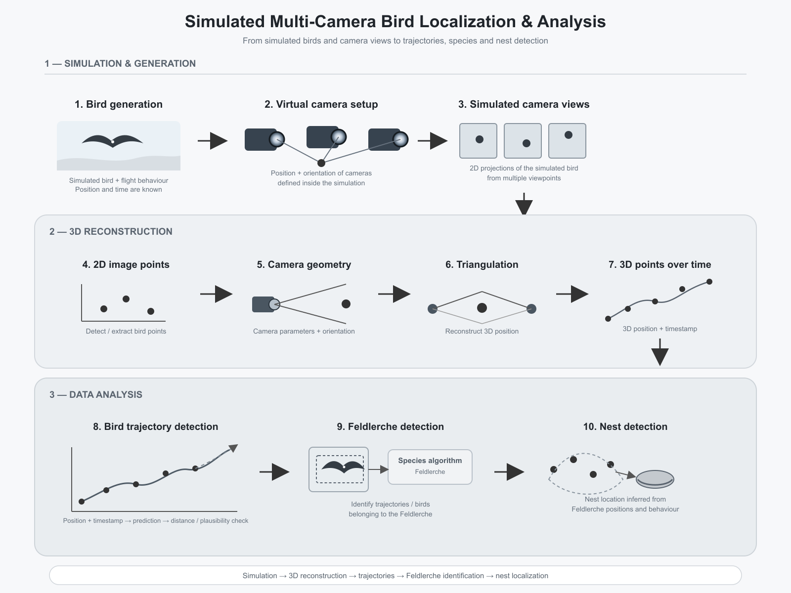

# Vogelerkennung – Simulation

Dieses Projekt simuliert die Erkennung und Lokalisierung von Vögeln mithilfe mehrerer virtueller Kameras. Dabei werden Vögel und Kameraperspektiven simuliert, aus den 2D-Bildpunkten 3D-Positionen rekonstruiert und anschließend die Flugbahnen analysiert.

## Installation

### Windows

Die folgenden Schritte können in der Eingabeaufforderung (CMD) oder im VS-Code-Terminal ausgeführt werden.

**1. Repository klonen**

```cmd
git clone https://github.com/covo02/vogelerkennung-simulation.git
cd vogelerkennung-simulation
```

**2. Virtuelle Umgebung erstellen und Abhängigkeiten installieren**

```cmd
python -m venv .dev
.dev\Scripts\activate.bat
pip install -r Requirements.txt
```

**3. Anwendung starten**

```cmd
python webinterface.py
```

Die Applikation kann anschließend über http://localhost:8060 geöffnet werden.

### macOS / Linux

**1. Repository klonen**

```bash
git clone https://github.com/covo02/vogelerkennung-simulation.git
cd vogelerkennung-simulation
```

**2. Virtuelle Umgebung erstellen und Abhängigkeiten installieren**

```bash
python3 -m venv .dev
source .dev/bin/activate
pip install -r Requirements.txt
```

**3. Anwendung starten**

```bash
python3 webinterface.py
```

Die Applikation kann anschließend über http://localhost:8060 geöffnet werden.

## Simulationsübersicht



## Dokumentation

Weitere Informationen befinden sich im [Nutzerhandbuch](Dokumentation/Nutzerhandbuch_Simulation.pdf).
